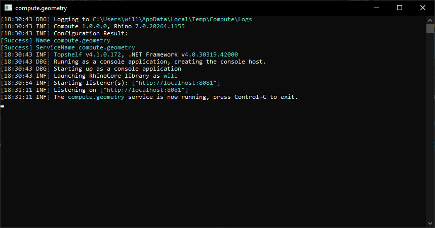

# Getting Started

## System Requirements

You will need a server or virtual machine with (minimum) Windows Server 2016 or 2019 (LTSC) installed is recommended. It's possible to run Compute on a Windows 10 machine, but this is only recommended for development and testing.

It's still Rhino running under the hood, albeit without the UI, so [spec](https://www.rhino3d.com/6/system_requirements) your machine(s) accordingly. AWS's [t2.medium](https://aws.amazon.com/ec2/instance-types/t2/) instance type (2 vCPU, 4 GB RAM) is a great starting point.

The machine can be totally fresh. Everything else is described in the [Installation](#-installation-) and [Configuration](#configuration) sections below.

## "Installation"

The following steps assume that you are either logged into the computer that will run Compute, or connected via Remote Desktop. Currently there is no "installer", but these are the steps to get things running!

1. Get the [latest build](https://ci.appveyor.com/project/mcneel/compute-rhino3d/branch/master/artifacts) from the `master` branch (the one named _compute-<build_number>.zip_). Alternatively you can [build from source](#building-from-source).
1. Unzip everything into an empty directory, e.g. `C:\path\to\compute`.
1. [Download](https://www.rhino3d.com/download/rhino/wip) and install the latest Rhino WIP.
1. Run Rhino at least once so that you can configure the license (we recommend Cloud Zoo) and validate it.
1. Start PowerShell, `cd C:\path\to\compute` and run `& .\compute.frontend.exe`.
1. Open a browser and try navigating to `http://localhost/version`.
1. Hit <kbd>Ctrl</kbd>+<kbd>C</kbd> to stop Compute
1. For next steps, see [Configuration](#configuration) and [Running Compute as a service](#running-compute-as-a-service).

## Configuration

### Calling Compute from another computer

Release builds of Compute listen on 0.0.0.0 by default so that you can connect from another computer. For this to work, you'll need to open ports in the Windows firewall. You may also need to configure URL reservation. The steps below assume you're using ports 80 for HTTP and 443 for HTTPS. If you're using another port, then you probably know what you're doing!

1. Start PowerShell as Administrator
1. Run `Install-WindowsFeature -name Web-Server -IncludeManagementTools` to install IIS and automatically open ports 80 and 443
1. Configure URL reservation:
    1. For HTTP, `netsh http add urlacl url="http://+:80/" user="Everyone"`
    1. For HTTPS, `netsh http add urlacl url="https://+:443/" user="Everyone"`

### Environment variables

All configuration of Compute – ports, authentication, etc. – is done via environment variables.
See [environment variables](environment_variables.md) for details

### HTTPS (optional)

HTTPS requires an SSL certificate. If you don't have one already, we recommend using [Let's Encrypt](https://letsencrypt.org).

1. Configure a your domain name (e.g. compute.example.com) to point to your server's IP address
1. Download [win-acme](https://pkisharp.github.io/win-acme/) and unzip
1. Start PowerShell as Administrator
1. Run `Install-WindowsFeature -name Web-Server -IncludeManagementTools` to install IIS (if you haven't already)
1. cd to unzipped directory
1. `& .\wacs.exe`
1. `N` create new certificate
1. `4` manually input host names
1. `compute.example.com` (or similar)
1. `1` for default web site
1. Enter your email address when prompted
1. `yes` to accept the license agreement
1. `Q` to Quit

## Running Compute as a service

Compute uses [TopShelf](https://github.com/topshelf/topshelf) to make it easy to configure and run it as a service on Windows.

1. Start PowerShell as Administrator
1. Run `cd path\to\Release\`
1. Run `& .\compute.frontend install` to install as a service
1. In the interactive menu, enter your username in the format `.\\[USERNAME]` (for example:`.\steve`) along with password for this account
1. ⚠️ **Important!** Make sure to run Rhino (and configure the license) at least once _as the user that the service will run as_!

## Scaling when using the Cloud Zoo

Rhino WIP encrypts Cloud Zoo license information by default. In order to create an image and scale your compute service you may need to disable encryption of the license information before creating your machine image. This is also a requirement for creating a [Docker image](../Dockerfile).

1. Open Rhino on the template machine (or host machine, in the case of Docker)
1. From the _Tools_ menu, click _Options_ then click _Advanced_
1. Search for `Rhino.LicensingSettings.CloudZooPlainText`
1. Select the checkbox to enable the plain text setting
1. ⚠️ **Important!** Close all instances of Rhino – changes do not take effect until Rhino is restarted
1. Start Rhino
1. Log back in to your Rhino Account
1. Close Rhino

An unencrpted login token will be created at `%appdata%\McNeel\Rhinoceros\7.0\License Manager\Licenses`. You can move this token to other computers. 

*Warning: do not share your cloudzoo.json file - it allows people to use Rhino and bill your core-hour team.* 

You can now create your machine image.

## Building from source and debugging

1. [Download](https://www.rhino3d.com/download/rhino/wip) and install the latest Rhino WIP.
1. Start Rhino WIP at least once to configure its license.
1. Open `src\compute.sln` in Visual Studio 2017 (or later) and compile as `Debug`.
1. In _Solution Explorer_, right-click _Solution 'compute'_, then click _Properties_.
1. In the _Startup Project_ tab, select _Multiple Startup Projects_, then set both `compute.frontend` and `compute.geometry` to _Start_.
1. Start the application in the debugger.
1. Wait for the backend to load... ☕️
    
1. Browse to http://localhost:8888/version to check that it's working!

## Other things to note

- The "frontend" is where the boring stuff lives – mostly authentication and request logging. The frontend proxies requests through to the "geometry backend". The backend is the bit that exposes a RESTful API that wraps functionality in RhinoCommon, Rhino.Python and Grasshopper.
- There is a health check URL (`/healthcheck`) in case you want to set up a load balancer
