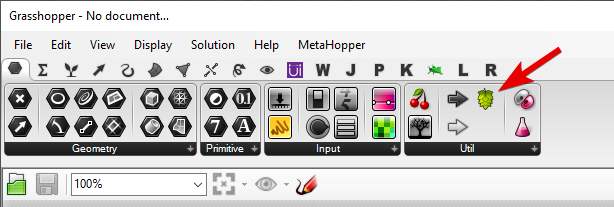
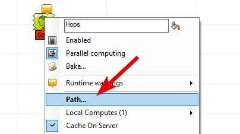
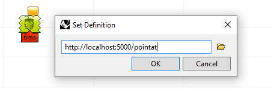
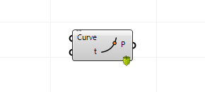
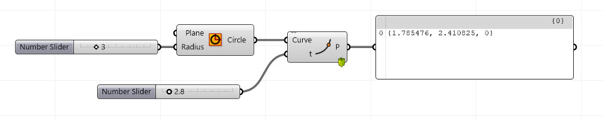

# Grasshopper Hops python servers

This python module helps you create python (specifically CPython) functions and use them inside your Grasshopper scripts using the new *Hops* components. This module can use its builtin default HTTP server to serve the functions as Grasshopper components, or act as a middleware to a [Flask](https://flask.palletsprojects.com/en/1.1.x/) app. It can also work alongside `[Rhino.Inside.Cpython](https://discourse.mcneel.com/t/rhino-inside-python/78987) to give full access to the [RhinoCommon API](https://developer.rhino3d.com/api/)


## Example

This is a python example defining a Hops python component that takes a curve and number as input and return coordinates on a point at given parameter on the curve. This example uses *Flask* as the http server:

```python
from flask import Flask
import ghhops_server as ghhs

# register hops app as middleware
app = Flask(__name__)
hops = ghhs.Hops(app)

@hops.component(
    "/pointat",
    name="PointAt",
    description="Get point along curve",
    icon="examples/pointat.png",
    inputs=[
        ghhs.HopsCurve("Curve", "C", "Curve to evaluate"),
        ghhs.HopsNumber("t", "t", "Parameter on Curve to evaluate"),
    ],
    outputs=[ghhs.HopsPoint("P", "P", "Point on curve at t")],
)
def pointat(curve, t):
    return curve.PointAt(t)

if __name__ == "__main__":
    app.run()
```


## Quick Start

Assuming you have python3 installed on your machine, follow the steps below to create your first Grasshopper Hops component:

1) Install `ghhops-server` (reads *Grasshopper Hops Server*) using your preferred python package manager. This will install the module and its dependancies. We will use `pip` for simplicity here but the same commands can work by for `pipenv`

    ```shell
    pip install ghhops-server
    ```

2) We are going to use *Flask* as the http server. So install flask as well:

    ```shell
    pip install flask
    ```

3) Let's create a python script and name it `app.py`. We will renamed `ghhops_server` on import to `ghhs` for simplicity:

    ```python
    # import flask, ghhops_server, and rhino3dm
    # rhino3dm is automatically installed with ghhops_server
    from flask import Flask
    import ghhops_server as ghhs
    import rhino3dm
    ```

4) Now continue on the python script to instantiate a Flask app, and add Hops as a middleware:

    ```python
    # register hops app as middleware
    app = Flask(__name__)
    hops = ghhs.Hops(app)
    ```

5) Now let's continue to create a Hops python component that takes a curve and number as input and return coordinates on a point at given parameter on the curve.
   - Note that we are using `@hops.component` decorator to decorate the function `pointat(curve, t)` as a Hops component. The first argument passed to the decorator (`"/pointat"`) is the URL of this component on our server. The rest are the information that Grasshopper needs to visualize the component on its canvas, show the input and outputs, icon, description, and the rest.

    - We are using Hops predefined parameter types (e.g. `HopsCurve`) to define the inputs and outputs. This is necessary so Hops knows which exact Grasshopper data type we want to use.
    - We have also specified an icon for this component `examples/pointat.png` but this is not required. Create a 24x24 png icon as you like and provide the path to it instead.

    ```python
    @hops.component(
        "/pointat",
        name="PointAt",
        description="Get point along curve",
        icon="examples/pointat.png",
        inputs=[
            ghhs.HopsCurve("Curve", "C", "Curve to evaluate"),
            ghhs.HopsNumber("t", "t", "Parameter on Curve to evaluate"),
        ],
        outputs=[ghhs.HopsPoint("P", "P", "Point on curve at t")],
    )
    def pointat(curve, t):
        return curve.PointAt(t)
    ```

6) Now let's end the script by running out Hops server:

    ```python
    if __name__ == "__main__":
        app.run()
    ```

    Save the python file and run it using python:

    ```shell
    python app.py
    ```

    You should see the report from the app initializing itself and waiting for calls to the flask server:

    ```shell
    [DEBUG] Using Hops Flask middleware
    [DEBUG] Component registered: <HopsComponent /pointat [Curve,t -> PointAt -> P] >
    ...
    [INFO]  * Running on http://127.0.0.1:5000/ (Press CTRL+C to quit)
    ```

7) Now open Rhino and Grasshopper, drop a Hops component on the Grasshopper canvas.

    

8) Right-Click on the hops component and input the component path as the url `http://127.0.0.1:5000/pointat`

    

    

    Hops component will update itself to show the input, output, and icon of the python component we just created. Note the small Hops badge on the lower right corner to show this is a Hops component under the hood:
    
    

9)  Now if you add a curve and a slider and connect them to the Hops component input, you should get the calculated point on the curve as output:

    

    
  
&nbsp;
&nbsp;
&nbsp;

--- 

&nbsp;
&nbsp;
&nbsp;

### Developer Notes

```shell
# Running test HTTP server
pipenv run hops_http

# Running test Flask server
pipenv run hops_flask

# Running test HTTP server with rhinoinside
pipenv run hops_rhinside

# Publishing package on Pypi
pipenv run build
```

Hops module structure:
- `base.py` base class for the Hops middleware:
  - component registration
  - input processing
  - solving
  - output processing
  - schema [un]wrap
- `component.py` Hops component
- `params.py` wrappers for supported params
- `middleware/` supported server backends:
  - handle http GET and POST in each framework

